Natividad Márquez Baena

# Práctica 3.5: Despliegue de una aplicación Flask (Python)

1.[Prerrequisitos](#1)
2.[Introducción](#2)
3.[Procedimiento completo para el despliegue](#3)
4.[Crear los archivos necesarios](#4)
5.[Comprobación de gunicorn](#5)
6.[Compronar gunicorn como servicio](#6)
7.[Configurar nginx](#7)
8.[Probar la aplicación y su ejecución](#8)
9.[Repetir el proceso con un repositorio de github](#9)

## Prerrequisitos 
Para la práctica se deben partir de ciertos elementos previos, en un servidor Debian para realizar el despliegue:

Nginx: Servidor web para manejar las solicitudes y respuestas.
Gunicorn: Servidor WSGI que conecta el servidor web con la aplicación Flask.
Pipenv: Herramienta para gestionar entornos virtuales y dependencias en Python.

## Introducción

El objetivo de esta práctica es aprender a desplegar una aplicación web desarrollada con Flask (Python) en un entorno de producción, utilizando herramientas como gunicorn, nginx y pipenv. Gunicorn se usa como servidor WSGI para manejar solicitudes y respuestas entre la aplicación y el servidor web. Nginx servirá como servidor web para gestionar el tráfico y servir la aplicación.

Por último con Pipenv se creará un entorno virtual. Se persigue garantizar un despliegue seguro, funcional y accesible en un entorno de producción.

## Procedimiento completo para el despliegue

Primeramente se instala el gestor de paquetes de Python pip y tambien el servidor de aplicaciones gunicorn:

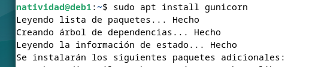
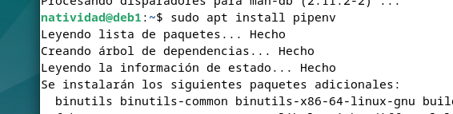
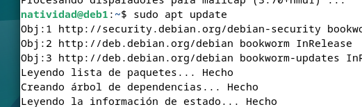
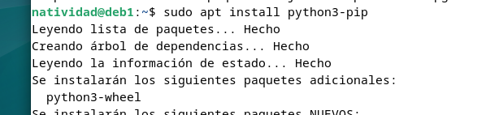

Comprobamos que se ha instalado correctamente la versión con:

Creamos el directorio en el que almacenaremos nuestro proyecto. Además, es importante otorgarle permisos a nuestro usuario y que pertenezca al grupo www-data. Con esto se permite que el servidor web y tu usuario puedan acceder y modificar los archivos del proyecto.Para ello se usa `chown`:

Ahora se va a crear la estructura del proyecto:

En el directorio creado, se creará un archivo oculto que contendrá las variables de entorno necesarias. En el archivo se añaden las variables de manera que una será el archivo `py`y otra el entorno `production`.

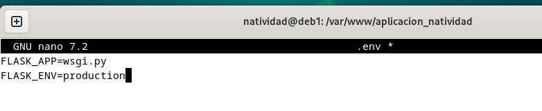

Se crea un entorno virtual con `pipenv shell` para asegurar que las dependencias del proyecto no afecten al sistema actual.

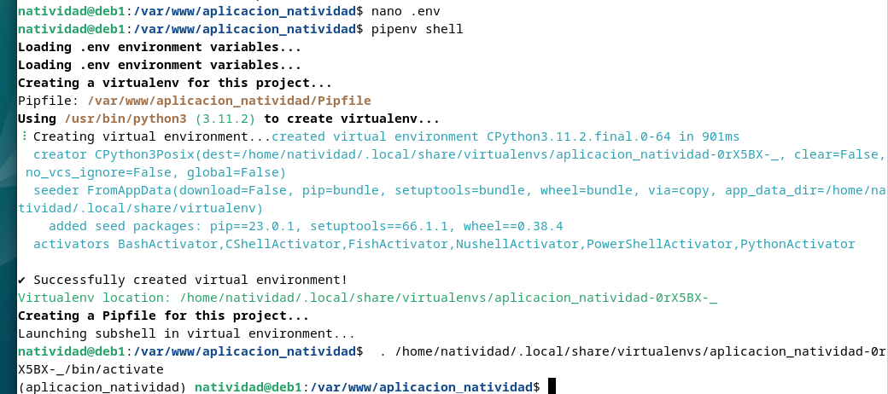

A continuación se instalará Flask para desarrollar la aplicación, y Gunicorn para ejecutar la aplicación en un entorno de producción.

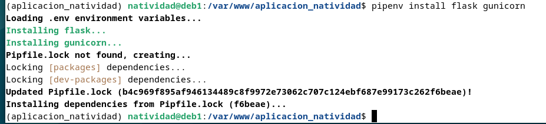

## Crear los archivos necesarios

Ahora se crea la aplicación de ejemplo. Para ello se crea un archivo `application.py` con la lógica del proyecto y `wsgi.py`, que configura cómo se ejecutará Flask a través de Gunicorn.

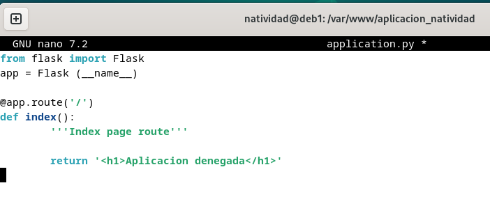
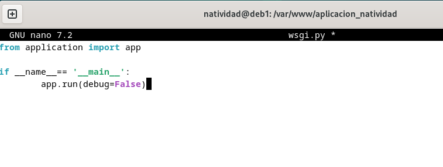

Ahora se prueba el funcionamiento de la aplicación en el servidor web integrado de Flask y accedemos a la dirección que obtenemos:

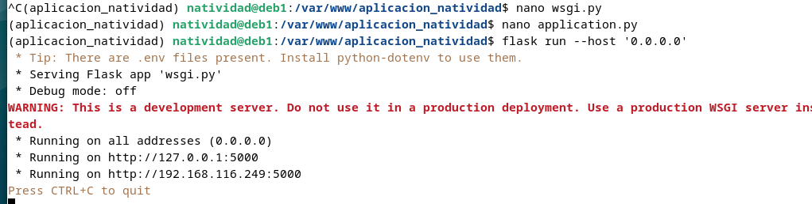
Como podemos comprobar, se puede acceder correctamente cpn `http://IP-maq-virtual:5000:`

## Comprobación de gunicorn

Se comprueba que Gunicorn funciona correctamente, ya que actúa como intermediario entre Flask y Nginx en producción:`gunicorn --workers 4 --bind 0.0.0.0:5000 wsgi:app`

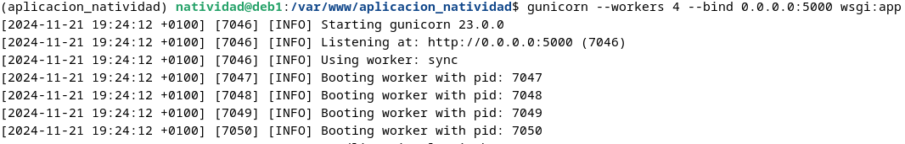

Es importante que se tome nota de cual es el path o ruta desde la que se ejecuta gunicorn para poder configurar más adelante un servicio del sistema. Esto se hace mediante el uso de `which gunicorn`:

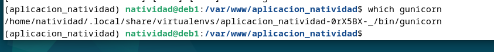

## Compronar gunicorn como servicio

Se va a hacer uso de nginx, por lo que se inicializa y se comprueba su estado.

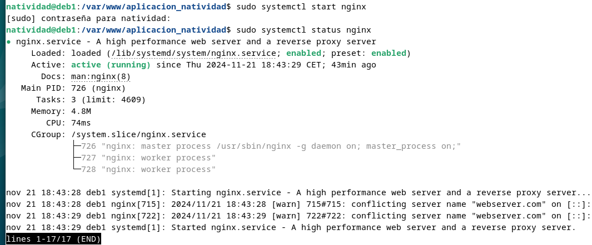

Ahora que se ha iniciado, se crea un archivo de servicio de systemd para que gunicorn se ejecute como servicio del sistema, con el siguiente contenido:

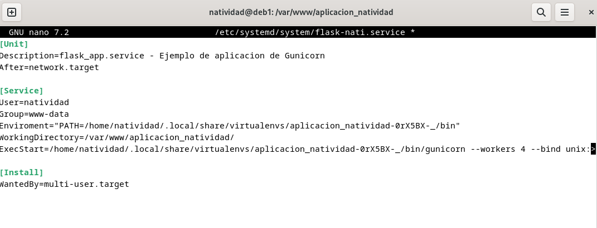

Ahora se habilita e inicia el servicio creado

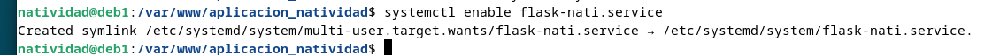

Hacemos un `systemctl status` para comprobar el estado del servicio y que funciona.

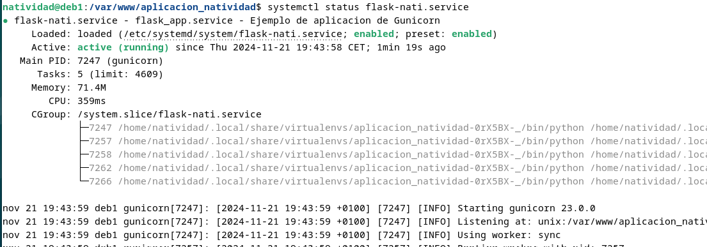

## Configurar nginx

Se creará una archivo de configuración de nginx con el nombre de nuestra aplicación y se establece la siguiente configuración:

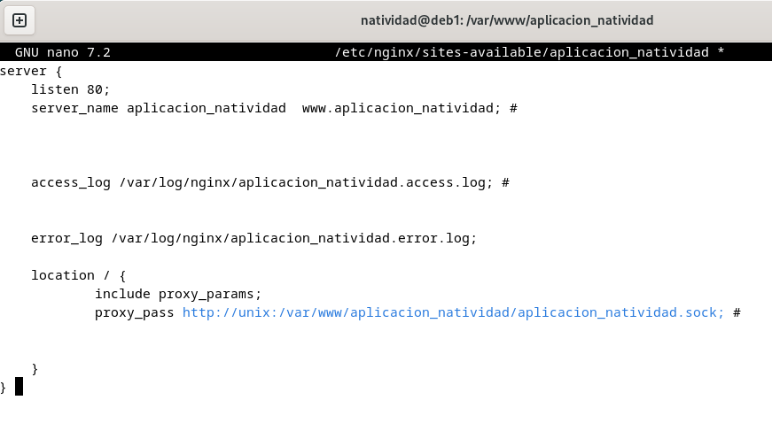

Se crea un link simbólico del archivo creado desde sitios webs disponibles a sitios web activos, es decir, del directorio `sites-available` a `sites-enabled`. Posteriormente lo comprobamos con un `ls -l`

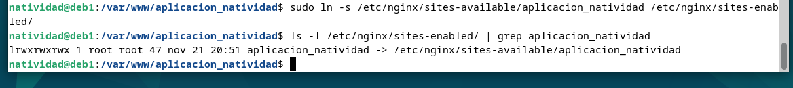

Finalmente se comprueba si el archivo es correcto con `sudo nginx -t` y se reinicia nginx para posteriormente comprobar el estado de este.

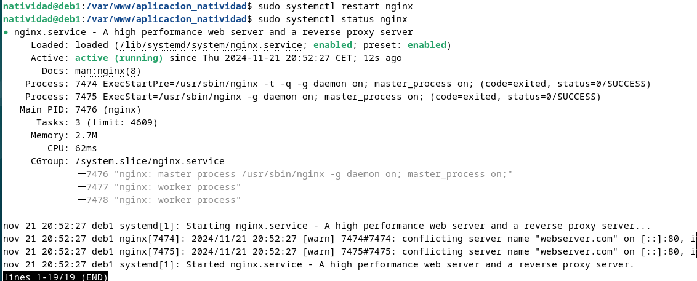

## Probar la aplicación y su ejecución

Ya no es posible acceder por IP a nuestra aplicación ya que ahora está siendo servida por Gunicorn y Nginx, necesitamos acceder por su `server_name`. Para ello se modifica el archivo `/etc/hosts` de nuestra máquina anfitriona para que asocie la IP de la máquina virtual, a nuestro `server_name`.
La ruta absoluta del archivo es  `C:\Windows\System32\drivers\etc\hosts`

Y se deberán añadir la línea:

`192.168.X.X myproject www.myproject`

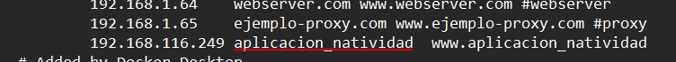

Ahora se debería de poder acceder a la aplicación desde la máquina anfitriona con `http://www.nombre_aplicacion`.

## Repetir el proceso con un repositorio de github

En esta parte se repetirá el proceso con una aplicación de github. Para ello se clonará el siguiente repositorio `git clone https://github.com/raul-profesor/Practica-3.5`, del cual se obtendrán los paquetes necesarios. El repositorio se clonará en `/var/www`.

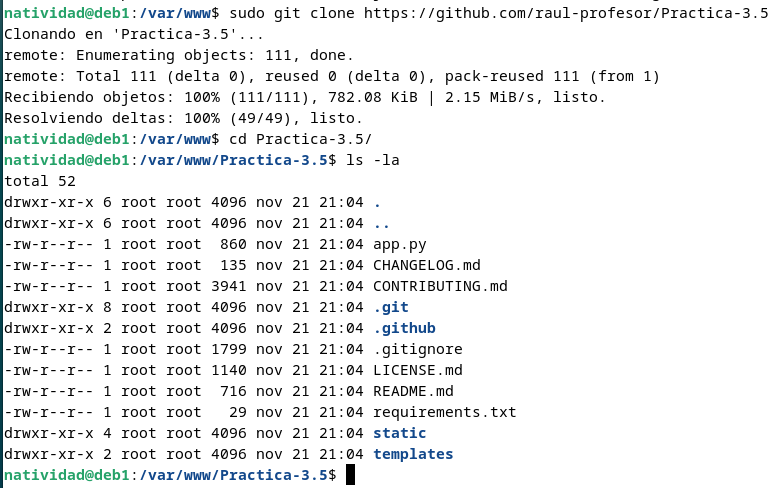

Se otorgan los permisos de la misma manera:

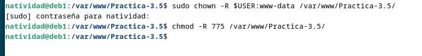

Ya en el directorio de la práctica, se arranca el entorno y se instalan las dependencias haciendo uso del archivo obtenido en el repositorio `pipenv install -r requirements.txt`.

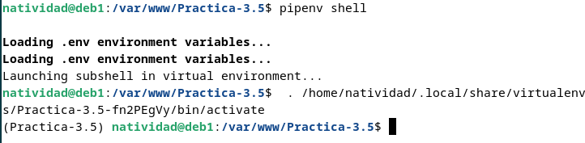

Se comprueba la ejecución de la aplicación:

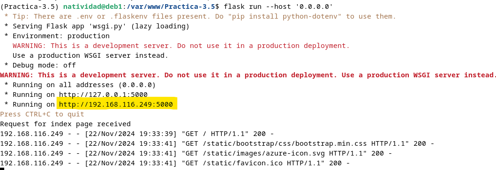

Y obtenemos el siguiente resultado.

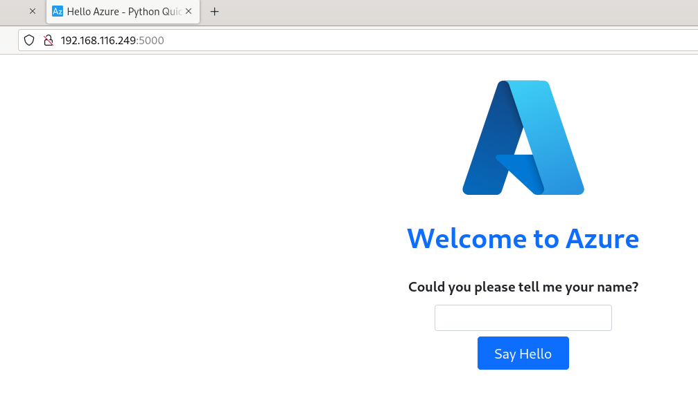

Ahora se comprobará la aplicación localmente

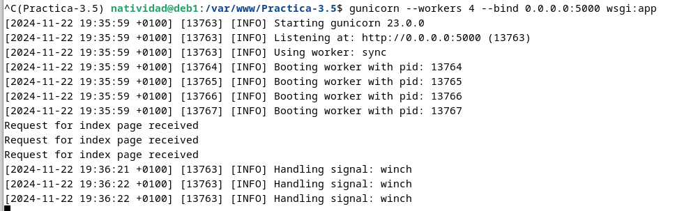

Repitiendo los pasos anteriores, se configura gunicorn como servicio

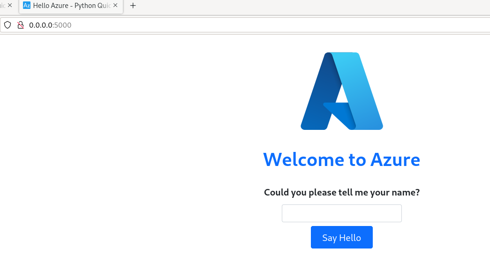

Se comprueba el estado

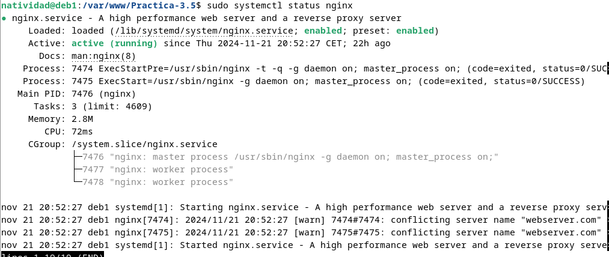

Creamos un archivo de servicio con el siguiente contenido:

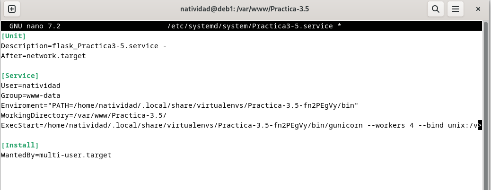

A continuación, se crea el archivo de configuración de nginx en el directorio de sitios disponibles

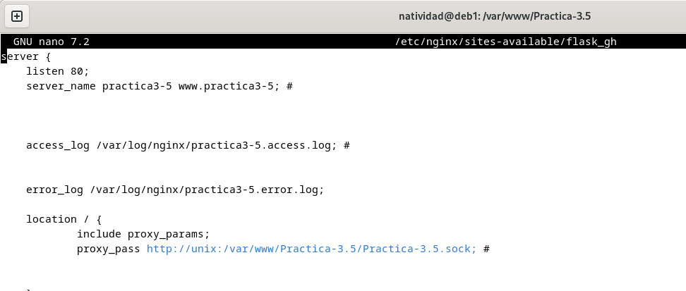

Se crea su enlace simbólico, se mueve al directorio se sitios activos y se comprueba que se ha realizado correctamente el proceso

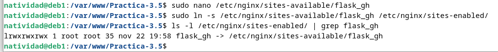

A continuación se realiza la comprobación sobre la sintaxis de los archivos, se reinicia el servicio y se comprueba su estado

Como en el procedimiento anterios, se modificará el archivo `/etc/hosts` de la máquina anfitriona, donde añadiremos una línea para asociar el nombre del servidor con su IP.

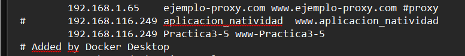

Finalmente, deberíamos de poder acceder a la aplicación mediante la búsqueda con `http://www.nombre_aplicacion`.

